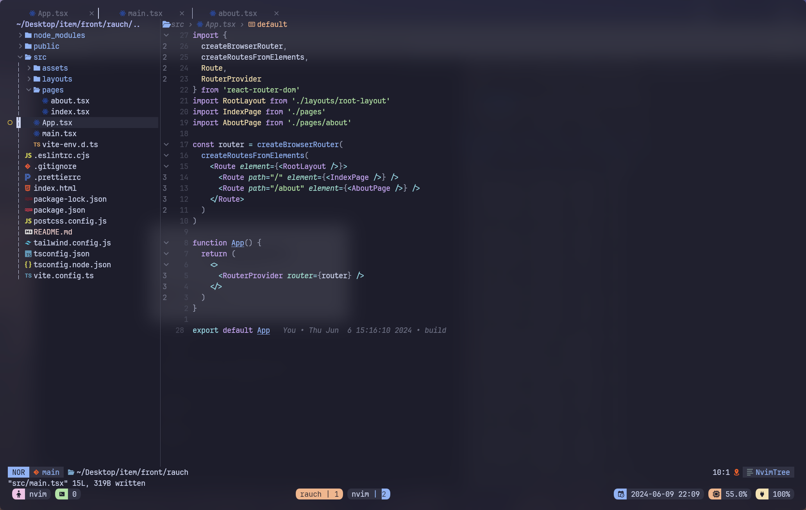

## preview

## wezterm

~/.config/wezterm/wezterm.lua

## tmux

~/.tmux.conf

## neovim

~/.config/nvim

### plugins

- lsp
- cmp
- treesitter
- lualine
- bufferline
- nvim-tree
- telescope
- mason
- bookmark
- todo-comment
- git
- mini-diff
- project
